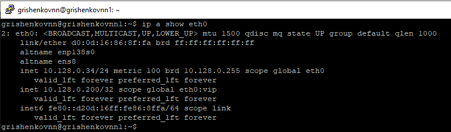
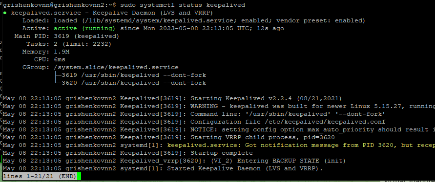
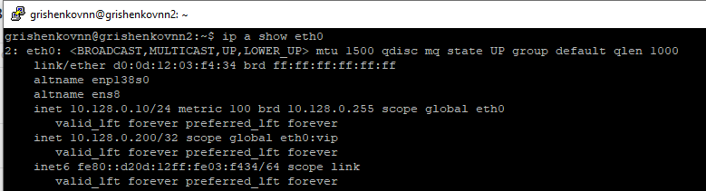

# Домашнее задание к занятию 10.1 «Keepalived/vrrp»

### Инструкция по выполнению домашнего задания

1. Сделайте fork [репозитория c Шаблоном решения](https://github.com/netology-code/sys-pattern-homework) к себе в Github и переименуйте его по названию или номеру занятия, например, https://github.com/имя-вашего-репозитория/gitlab-hw или https://github.com/имя-вашего-репозитория/8-03-hw).
2. Выполните клонирование данного репозитория к себе на ПК с помощью команды `git clone`.
3. Выполните домашнее задание и заполните у себя локально этот файл README.md:
   - впишите вверху название занятия и вашу фамилию и имя
   - в каждом задании добавьте решение в требуемом виде (текст/код/скриншоты/ссылка)
   - для корректного добавления скриншотов воспользуйтесь инструкцией ["Как вставить скриншот в шаблон с решением"](https://github.com/netology-code/sys-pattern-homework/blob/main/screen-instruction.md)
   - при оформлении используйте возможности языка разметки md (коротко об этом можно посмотреть в [инструкции по MarkDown](https://github.com/netology-code/sys-pattern-homework/blob/main/md-instruction.md))
4. После завершения работы над домашним заданием сделайте коммит (`git commit -m "comment"`) и отправьте его на Github (`git push origin`);
5. Для проверки домашнего задания преподавателем в личном кабинете прикрепите и отправьте ссылку на решение в виде md-файла в вашем Github.
6. Любые вопросы по выполнению заданий спрашивайте в чате учебной группы и/или в разделе “Вопросы по заданию” в личном кабинете.

Желаем успехов в выполнении домашнего задания!

---

### Задание 1

Разверните топологию из лекции и выполните установку и настройку сервиса Keepalived. 

```
vrrp_instance test {

state "name_mode"

interface "name_interface"

virtual_router_id "number id"

priority "number priority"

advert_int "number advert"

authentication {

auth_type "auth type"

auth_pass "password"

}

unicast_peer {

"ip address host"

}

virtual_ipaddress {

"ip address host" dev "interface" label "interface":vip

}

}

```

*В качестве решения предоставьте:*   
*- рабочую конфигурацию обеих нод, оформленную как блок кода в вашем md-файле;*   
*- скриншоты статуса сервисов, на которых видно, что одна нода перешла в MASTER, а вторая в BACKUP state.*   
```
udo apt update
sudo apt install iptables-persistent keepalived
sudo iptables -I INPUT -p vrrp -d 224.0.0.18 -j ACCEPT
sudo netfilter-persistent save
sudo nano /etc/keepalived/keepalived.conf  # Содержимое файла keepalived.conf для нод master и backup ниже в блоке
sudo systemctl start keepalived
sudo systemctl enable keepalived
sudo systemctl status keepalived
ip a show eth0
```
Файл keepalived.conf для ноды MASTER
```
vrrp_instance VI_1 {
    state MASTER
    interface eth0
    virtual_router_id 51
    priority 110
    advert_int 4

    authentication {
    auth_type PASS
    auth_pass password
    }

    unicast_peer {
    10.128.0.34
    }

    virtual_ipaddress {
    10.128.0.200 dev eth0 label eth0:vip
    }

}

```
Файл keepalived.conf для ноды BACKUP
```
vrrp_instance VI_2 {
state BACKUP
interface eth0
virtual_router_id 51
priority 100
advert_int 4

authentication {
auth_type PASS
auth_pass password
}

unicast_peer {
10.128.0.10
}

virtual_ipaddress {
10.128.0.200 dev eth0 label eth0:vip
}

}
```






